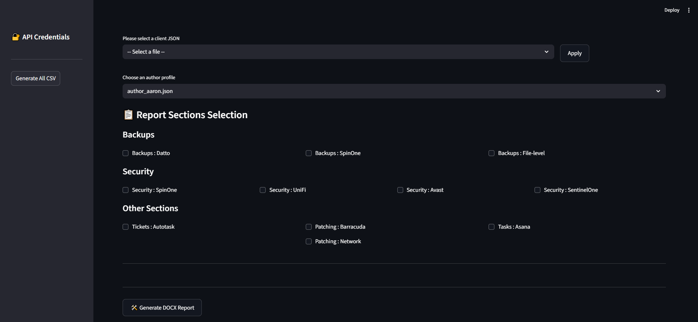

# 📊 IT Report Automation for MSP

**August 2025 – December 2025**

An automation pipeline built with Streamlit that aggregates data from 11 different IT management APIs (Datto, Autotask, SentinelOne, UniFi, Spin.ai, and more) to generate comprehensive compliance reports with GPT‑driven risk summaries and executive insights.

This solution replaced a manual process that previously took 2–3 hours per client, reducing report generation time to under 15 minutes – a 90% reduction that eliminated manual copy‑paste errors and scaled reporting to 20+ clients without adding headcount.

---

  

---

## 🧠 How It Works (At a Glance)

The platform automates the entire IT compliance reporting workflow for Managed Service Providers (MSPs):

- **Multi‑API Data Aggregation** – Connects to 11 APIs including Datto, Autotask, SentinelOne, UniFi, and Spin.ai to pull real‑time client infrastructure data.
- **Intelligent Report Generation** – Uses python‑docx and Word COM automation to generate professional DOCX compliance reports with consistent formatting.
- **AI‑Driven Insights** – Leverages GPT to analyse raw data and produce risk summaries and executive‑level recommendations, making reports actionable and understandable.
- **Scalable Automation** – Processes multiple clients simultaneously, enabling reporting for 20+ clients with zero additional headcount.
- **Streamlit Interface** – A clean, user‑friendly dashboard that allows technicians to generate and review reports with a single click.

---

## 🧰 Technologies Used

| Area | Technologies |
|------|--------------|
| **Framework** | Streamlit |
| **Automation** | Python, python‑docx, Word COM automation |
| **AI / LLM** | GPT‑driven risk summarisation and insight generation |
| **APIs** | Datto, Autotask, SentinelOne, UniFi, Spin.ai, and 6+ more |
| **Data Processing** | Python (pandas, requests, json) |
| **Output** | DOCX compliance reports |

---

This project showcases how the strategic combination of API integration, generative AI, and workflow automation can transform a labor‑intensive manual process into an efficient, scalable, and error‑free solution – delivering tangible business value in a real‑world MSP environment.
